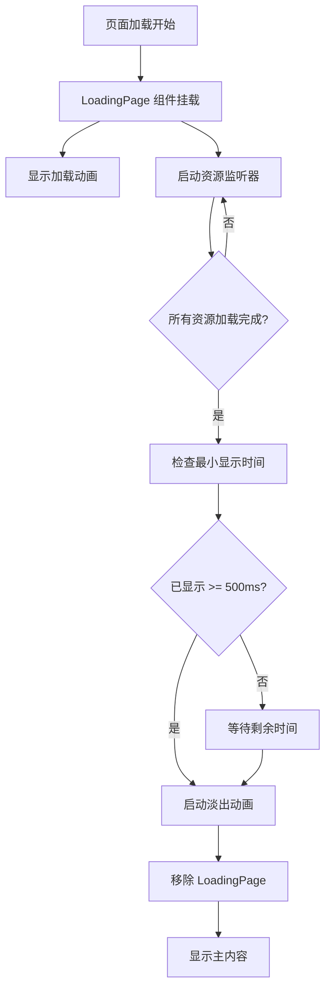

# 设计文档：明日方舟风格加载页面

## 概述

本设计文档描述了一个明日方舟（Arknights）风格的加载页面实现方案。该加载页面将在用户首次访问网站时显示，提供视觉反馈并确保所有资源加载完成后再显示主内容。

### 设计目标

1. **视觉一致性**: 遵循明日方舟游戏的现代极简主义美学
2. **性能优化**: 确保加载页面本身不影响网站性能
3. **用户体验**: 提供流畅的加载动画和平滑的过渡效果
4. **技术集成**: 无缝集成到 Next.js 应用架构中
5. **可访问性**: 支持辅助技术和屏幕阅读器

### 技术栈

- **框架**: Next.js 14+ (App Router)
- **UI 库**: React 18+
- **类型系统**: TypeScript
- **样式方案**: Tailwind CSS
- **动画**: CSS Animations + Transitions

## 架构

### 组件层次结构

```
RootLayout (src/app/layout.tsx)
└── LoadingPage (新增客户端组件)
    ├── LoadingOverlay (全屏覆盖层)
    ├── ArknightsVisuals (明日方舟风格视觉元素)
    │   ├── GeometricShapes (几何图形)
    │   ├── AnimatedLines (动画线条)
    │   └── LoadingSpinner (加载旋转器)
    └── LoadingProgress (加载进度指示器 - 可选)
```

### 数据流



### 状态管理

加载页面使用 React 本地状态管理，不需要全局状态管理库：

```typescript
interface LoadingState {
  isLoading: boolean;        // 是否正在加载
  isResourcesReady: boolean; // 资源是否准备就绪
  isMinTimeElapsed: boolean; // 最小显示时间是否已过
  isFadingOut: boolean;      // 是否正在淡出
}
```

## 组件和接口

### 1. LoadingPage 组件

**职责**: 主加载页面组件，协调所有子组件和加载逻辑

**接口**:

```typescript
interface LoadingPageProps {
  minDisplayTime?: number;  // 最小显示时间（毫秒），默认 500
  fadeOutDuration?: number; // 淡出动画时长（毫秒），默认 400
}

export default function LoadingPage({
  minDisplayTime = 500,
  fadeOutDuration = 400
}: LoadingPageProps): JSX.Element | null
```

**实现要点**:
- 使用 `'use client'` 指令标记为客户端组件
- 使用 `useState` 管理加载状态
- 使用 `useEffect` 监听资源加载和时间
- 条件渲染：加载完成后返回 `null`

### 2. useResourceLoader Hook

**职责**: 监听浏览器资源加载状态

**接口**:

```typescript
interface ResourceLoaderResult {
  isReady: boolean;           // 所有资源是否准备就绪
  loadedResources: number;    // 已加载资源数量（可选）
  totalResources: number;     // 总资源数量（可选）
}

function useResourceLoader(): ResourceLoaderResult
```

**实现策略**:

1. **监听 window.load 事件**: 所有资源（图片、脚本、样式表）加载完成
2. **监听 document.fonts.ready**: 字体加载完成
3. **监听 document.readyState**: 文档解析状态

```typescript
useEffect(() => {
  // 检查初始状态
  if (document.readyState === 'complete') {
    setIsReady(true);
    return;
  }

  // 监听 load 事件
  const handleLoad = () => {
    // 等待字体加载
    document.fonts.ready.then(() => {
      setIsReady(true);
    });
  };

  window.addEventListener('load', handleLoad);
  
  return () => {
    window.removeEventListener('load', handleLoad);
  };
}, []);
```

### 3. useMinimumDisplayTime Hook

**职责**: 确保加载页面显示至少指定的最小时间

**接口**:

```typescript
interface MinimumDisplayTimeResult {
  isMinTimeElapsed: boolean;  // 最小时间是否已过
}

function useMinimumDisplayTime(
  minTime: number  // 最小显示时间（毫秒）
): MinimumDisplayTimeResult
```

**实现策略**:

```typescript
useEffect(() => {
  const startTime = Date.now();
  
  const timer = setTimeout(() => {
    setIsMinTimeElapsed(true);
  }, minTime);
  
  return () => clearTimeout(timer);
}, [minTime]);
```

### 4. ArknightsVisuals 组件

**职责**: 渲染明日方舟风格的视觉元素

**接口**:

```typescript
interface ArknightsVisualsProps {
  isAnimating: boolean;  // 是否播放动画
}

function ArknightsVisuals({ 
  isAnimating 
}: ArknightsVisualsProps): JSX.Element
```

**视觉元素设计**:

1. **背景**: 纯黑色 `bg-black`
2. **几何图形**:
   - 大三角形（左上角）：使用 CSS border 技巧或 SVG
   - 矩形边框（右下角）：使用 border 和 absolute 定位
   - 斜线装饰：使用旋转的 div 或 SVG line
3. **颜色方案**:
   - 主色：黑色 `#000000`
   - 强调色：蓝色 `#00A8FF` 或 `#0EA5E9` (Tailwind sky-500)
4. **动画元素**:
   - 旋转的六边形或圆环
   - 脉动的光效
   - 移动的线条

**示例结构**:

```typescript
<div className="relative w-full h-full bg-black overflow-hidden">
  {/* 背景几何图形 */}
  <div className="absolute top-0 left-0 w-64 h-64 border-l-[200px] border-l-transparent border-b-[200px] border-b-sky-500/10" />
  
  {/* 右下角矩形边框 */}
  <div className="absolute bottom-8 right-8 w-48 h-32 border-2 border-sky-500/30" />
  
  {/* 中心加载动画 */}
  <div className="absolute inset-0 flex items-center justify-center">
    <LoadingSpinner isAnimating={isAnimating} />
  </div>
  
  {/* 装饰线条 */}
  <div className="absolute top-1/3 left-1/4 w-32 h-0.5 bg-sky-500/50 rotate-45" />
</div>
```

### 5. LoadingSpinner 组件

**职责**: 显示旋转的加载动画

**接口**:

```typescript
interface LoadingSpinnerProps {
  isAnimating: boolean;  // 是否播放动画
  size?: number;         // 尺寸（像素），默认 80
}

function LoadingSpinner({ 
  isAnimating,
  size = 80 
}: LoadingSpinnerProps): JSX.Element
```

**动画设计**:

使用 CSS 动画创建旋转效果：

```css
@keyframes spin {
  from {
    transform: rotate(0deg);
  }
  to {
    transform: rotate(360deg);
  }
}

@keyframes pulse {
  0%, 100% {
    opacity: 1;
  }
  50% {
    opacity: 0.5;
  }
}
```

**实现方案**:

```typescript
<div 
  className={`relative ${isAnimating ? 'animate-spin' : ''}`}
  style={{ width: size, height: size }}
>
  {/* 外圈 */}
  <div className="absolute inset-0 border-4 border-sky-500/20 rounded-full" />
  
  {/* 旋转的弧线 */}
  <div className="absolute inset-0 border-4 border-transparent border-t-sky-500 rounded-full" />
  
  {/* 内部装饰 */}
  <div className="absolute inset-2 border-2 border-sky-500/40 rounded-full animate-pulse" />
</div>
```

## 数据模型

### LoadingState 类型

```typescript
/**
 * 加载页面的状态
 */
interface LoadingState {
  /** 是否正在加载 */
  isLoading: boolean;
  
  /** 资源是否准备就绪 */
  isResourcesReady: boolean;
  
  /** 最小显示时间是否已过 */
  isMinTimeElapsed: boolean;
  
  /** 是否正在淡出 */
  isFadingOut: boolean;
}
```

### LoadingConfig 类型

```typescript
/**
 * 加载页面配置
 */
interface LoadingConfig {
  /** 最小显示时间（毫秒） */
  minDisplayTime: number;
  
  /** 淡出动画时长（毫秒） */
  fadeOutDuration: number;
  
  /** 是否启用调试模式 */
  debug?: boolean;
}

/**
 * 默认配置
 */
const DEFAULT_LOADING_CONFIG: LoadingConfig = {
  minDisplayTime: 500,
  fadeOutDuration: 400,
  debug: false
};
```

## 正确性属性

*属性（Property）是一种特征或行为，应该在系统的所有有效执行中保持为真——本质上是关于系统应该做什么的形式化陈述。属性是人类可读规范和机器可验证正确性保证之间的桥梁。*


### 属性 1: 资源加载完成触发状态更新

*对于任何* 资源加载状态，当所有关键资源（图片、字体、脚本）加载完成时，Resource_Loader 应该将 isResourcesReady 状态设置为 true

**验证需求: 3.5**

### 属性 2: 最小显示时间保证

*对于任何* 资源加载完成时间，加载页面应该显示至少 500 毫秒，即使资源在更短时间内加载完成

**验证需求: 4.2, 4.3**

### 属性 3: 加载完成后的过渡和卸载

*对于任何* 加载状态，当资源准备就绪且最小显示时间已过时，组件应该启动淡出动画并在动画完成后从 DOM 中完全移除

**验证需求: 5.1, 5.4, 6.6**

### 属性 4: 事件监听器清理

*对于任何* 组件卸载场景，所有注册的事件监听器（window.load、document.fonts.ready 等）应该在组件卸载时被正确移除

**验证需求: 9.4**

### 属性 5: 可访问性状态通知

*对于任何* 加载状态变化（从加载中到加载完成），组件应该通过 ARIA 属性更新通知辅助技术状态变化

**验证需求: 10.5**

### 属性 6: 后续访问的条件显示

*对于任何* 页面访问，如果资源已被浏览器缓存且 document.readyState 为 'complete'，加载页面应该立即完成而不显示或快速消失

**验证需求: 7.5**

## 错误处理

### 1. 资源加载超时

**场景**: 某些资源加载时间过长或失败

**处理策略**:
- 设置最大加载等待时间（例如 10 秒）
- 超时后自动完成加载流程
- 在开发模式下记录警告日志

```typescript
useEffect(() => {
  const maxWaitTime = 10000; // 10 秒
  
  const timeoutId = setTimeout(() => {
    if (!isResourcesReady) {
      console.warn('Resource loading timeout, proceeding anyway');
      setIsResourcesReady(true);
    }
  }, maxWaitTime);
  
  return () => clearTimeout(timeoutId);
}, [isResourcesReady]);
```

### 2. 浏览器不支持某些 API

**场景**: 旧浏览器可能不支持 `document.fonts.ready`

**处理策略**:
- 使用特性检测
- 提供降级方案

```typescript
const checkFontsReady = async () => {
  if ('fonts' in document) {
    await document.fonts.ready;
  } else {
    // 降级：等待固定时间
    await new Promise(resolve => setTimeout(resolve, 1000));
  }
};
```

### 3. 组件挂载前资源已加载完成

**场景**: 在快速网络或缓存情况下，资源可能在组件挂载前就已完成

**处理策略**:
- 在 useEffect 中检查初始状态
- 如果 `document.readyState === 'complete'`，立即设置为就绪

```typescript
useEffect(() => {
  // 检查初始状态
  if (document.readyState === 'complete') {
    checkFontsReady().then(() => setIsReady(true));
    return;
  }
  
  // 否则设置监听器
  // ...
}, []);
```

### 4. 动画性能问题

**场景**: 在低性能设备上动画可能卡顿

**处理策略**:
- 使用 CSS 动画而非 JavaScript 动画
- 使用 `will-change` 提示浏览器优化
- 使用 `transform` 和 `opacity` 等 GPU 加速属性
- 提供简化动画的选项（通过 `prefers-reduced-motion` 媒体查询）

```typescript
<div className="motion-safe:animate-spin motion-reduce:animate-none">
  {/* 动画内容 */}
</div>
```

## 测试策略

### 单元测试

使用 **Jest** 和 **React Testing Library** 进行组件单元测试。

#### 测试覆盖范围

1. **组件渲染测试**:
   - LoadingPage 组件正确渲染
   - 包含所有必需的子组件
   - 应用正确的样式类

2. **状态管理测试**:
   - 初始状态正确设置
   - 状态转换按预期工作
   - 条件渲染逻辑正确

3. **Hook 测试**:
   - useResourceLoader 正确监听事件
   - useMinimumDisplayTime 正确计时
   - 清理函数正确执行

4. **可访问性测试**:
   - ARIA 属性正确设置
   - 屏幕阅读器文本存在
   - 键盘导航支持（如适用）

#### 示例测试用例

```typescript
describe('LoadingPage', () => {
  it('应该在挂载时显示加载页面', () => {
    render(<LoadingPage />);
    expect(screen.getByRole('status')).toBeInTheDocument();
  });
  
  it('应该包含 ARIA 标签', () => {
    render(<LoadingPage />);
    const loadingElement = screen.getByRole('status');
    expect(loadingElement).toHaveAttribute('aria-live', 'polite');
  });
  
  it('应该使用黑色背景', () => {
    render(<LoadingPage />);
    const loadingElement = screen.getByRole('status');
    expect(loadingElement).toHaveClass('bg-black');
  });
});
```

### 属性测试

使用 **fast-check** 库进行基于属性的测试。每个属性测试应该运行至少 100 次迭代。

#### 属性测试 1: 最小显示时间保证

```typescript
import fc from 'fast-check';

describe('Property: 最小显示时间保证', () => {
  it('对于任何资源加载完成时间，加载页面应该显示至少 500ms', () => {
    // Feature: arknights-loading-page, Property 2: 最小显示时间保证
    
    fc.assert(
      fc.property(
        fc.integer({ min: 0, max: 2000 }), // 资源加载时间
        async (resourceLoadTime) => {
          const startTime = Date.now();
          
          // 模拟组件行为
          const minDisplayTime = 500;
          await new Promise(resolve => setTimeout(resolve, resourceLoadTime));
          
          const shouldWait = resourceLoadTime < minDisplayTime;
          if (shouldWait) {
            await new Promise(resolve => 
              setTimeout(resolve, minDisplayTime - resourceLoadTime)
            );
          }
          
          const elapsedTime = Date.now() - startTime;
          
          // 验证：总时间应该至少为 500ms
          expect(elapsedTime).toBeGreaterThanOrEqual(minDisplayTime);
        }
      ),
      { numRuns: 100 }
    );
  });
});
```

#### 属性测试 2: 事件监听器清理

```typescript
describe('Property: 事件监听器清理', () => {
  it('对于任何组件卸载场景，所有事件监听器应该被移除', () => {
    // Feature: arknights-loading-page, Property 4: 事件监听器清理
    
    fc.assert(
      fc.property(
        fc.boolean(), // 是否快速卸载
        (quickUnmount) => {
          const addEventListenerSpy = jest.spyOn(window, 'addEventListener');
          const removeEventListenerSpy = jest.spyOn(window, 'removeEventListener');
          
          const { unmount } = render(<LoadingPage />);
          
          const addedListeners = addEventListenerSpy.mock.calls.length;
          
          if (quickUnmount) {
            unmount();
          } else {
            // 等待一段时间后卸载
            act(() => {
              jest.advanceTimersByTime(1000);
            });
            unmount();
          }
          
          const removedListeners = removeEventListenerSpy.mock.calls.length;
          
          // 验证：移除的监听器数量应该等于添加的数量
          expect(removedListeners).toBe(addedListeners);
          
          addEventListenerSpy.mockRestore();
          removeEventListenerSpy.mockRestore();
        }
      ),
      { numRuns: 100 }
    );
  });
});
```

#### 属性测试 3: 可访问性状态通知

```typescript
describe('Property: 可访问性状态通知', () => {
  it('对于任何加载状态变化，应该更新 ARIA 属性', () => {
    // Feature: arknights-loading-page, Property 5: 可访问性状态通知
    
    fc.assert(
      fc.property(
        fc.record({
          isLoading: fc.boolean(),
          isComplete: fc.boolean()
        }),
        ({ isLoading, isComplete }) => {
          const { rerender } = render(
            <LoadingPage 
              isLoading={isLoading} 
              isComplete={isComplete} 
            />
          );
          
          const statusElement = screen.queryByRole('status');
          
          if (isLoading && !isComplete) {
            expect(statusElement).toBeInTheDocument();
            expect(statusElement).toHaveAttribute('aria-busy', 'true');
          } else if (isComplete) {
            // 加载完成后，状态应该更新或组件应该被移除
            if (statusElement) {
              expect(statusElement).toHaveAttribute('aria-busy', 'false');
            }
          }
        }
      ),
      { numRuns: 100 }
    );
  });
});
```

### 集成测试

#### 测试场景

1. **完整加载流程**:
   - 页面加载 → 显示加载页面 → 资源加载完成 → 等待最小时间 → 淡出 → 显示主内容

2. **快速加载场景**:
   - 资源在 100ms 内加载完成 → 加载页面仍显示至少 500ms

3. **慢速加载场景**:
   - 资源加载超过 500ms → 加载完成后立即开始淡出

4. **缓存场景**:
   - 后续访问 → 资源已缓存 → 加载页面快速消失或不显示

### 视觉回归测试

使用 **Playwright** 或 **Chromatic** 进行视觉回归测试：

1. 捕获加载页面的截图
2. 验证视觉元素的位置和样式
3. 检查不同屏幕尺寸下的响应式布局
4. 验证动画的关键帧

### 性能测试

1. **加载时间测试**:
   - 测量加载页面组件的渲染时间
   - 确保不超过 50ms

2. **动画性能测试**:
   - 使用 Chrome DevTools Performance 面板
   - 验证动画帧率保持在 60 FPS

3. **内存泄漏测试**:
   - 多次挂载和卸载组件
   - 验证内存使用量保持稳定

## 实现注意事项

### 1. Next.js App Router 集成

在 `src/app/layout.tsx` 中集成加载页面：

```typescript
import LoadingPage from '@/components/LoadingPage';

export default function RootLayout({ children }) {
  return (
    <html lang="zh">
      <body>
        <LoadingPage />
        <Header />
        {children}
      </body>
    </html>
  );
}
```

### 2. 避免闪烁

确保加载页面在服务端渲染时不显示，只在客户端显示：

```typescript
'use client';

export default function LoadingPage() {
  const [isMounted, setIsMounted] = useState(false);
  
  useEffect(() => {
    setIsMounted(true);
  }, []);
  
  if (!isMounted) return null;
  
  // 渲染加载页面
}
```

### 3. Z-Index 管理

确保加载页面在最顶层：

```typescript
<div className="fixed inset-0 z-[9999] bg-black">
  {/* 内容 */}
</div>
```

### 4. 性能优化

- 使用 `transform` 和 `opacity` 进行动画（GPU 加速）
- 避免在动画期间触发重排（reflow）
- 使用 `will-change` 提示浏览器优化

```typescript
<div className="will-change-transform will-change-opacity">
  {/* 动画元素 */}
</div>
```

### 5. 可访问性最佳实践

```typescript
<div 
  role="status" 
  aria-live="polite" 
  aria-busy={isLoading}
  aria-label={isLoading ? "页面加载中" : "页面加载完成"}
>
  <span className="sr-only">
    {isLoading ? "正在加载页面资源，请稍候..." : "加载完成"}
  </span>
  {/* 视觉内容 */}
</div>
```

## 文件结构

```
src/
├── components/
│   ├── loading/
│   │   ├── LoadingPage.tsx          # 主加载页面组件
│   │   ├── ArknightsVisuals.tsx     # 明日方舟视觉元素
│   │   ├── LoadingSpinner.tsx       # 加载旋转器
│   │   ├── useResourceLoader.ts     # 资源加载 Hook
│   │   ├── useMinimumDisplayTime.ts # 最小显示时间 Hook
│   │   └── types.ts                 # TypeScript 类型定义
│   └── ...
├── app/
│   ├── layout.tsx                   # 集成加载页面
│   └── ...
└── __tests__/
    └── components/
        └── loading/
            ├── LoadingPage.test.tsx
            ├── LoadingPage.property.test.tsx
            ├── ArknightsVisuals.test.tsx
            └── hooks.test.ts
```

## 依赖项

### 生产依赖

- `react`: ^18.0.0
- `next`: ^14.0.0
- `typescript`: ^5.0.0

### 开发依赖

- `@testing-library/react`: ^14.0.0
- `@testing-library/jest-dom`: ^6.0.0
- `jest`: ^29.0.0
- `fast-check`: ^3.0.0 (用于属性测试)
- `@playwright/test`: ^1.40.0 (用于 E2E 测试)

## 未来扩展

### 1. 加载进度显示

添加实际的加载进度百分比：

```typescript
interface LoadingPageProps {
  showProgress?: boolean;
}

// 跟踪已加载资源数量
const [progress, setProgress] = useState(0);
```

### 2. 自定义主题

允许自定义颜色方案：

```typescript
interface LoadingPageProps {
  theme?: {
    primaryColor: string;
    accentColor: string;
  };
}
```

### 3. 动画变体

提供多种动画风格选择：

```typescript
interface LoadingPageProps {
  animationStyle?: 'spinner' | 'pulse' | 'wave';
}
```

### 4. 跳过按钮

对于慢速连接，允许用户跳过加载页面：

```typescript
const [showSkipButton, setShowSkipButton] = useState(false);

useEffect(() => {
  const timer = setTimeout(() => {
    setShowSkipButton(true);
  }, 3000); // 3 秒后显示跳过按钮
  
  return () => clearTimeout(timer);
}, []);
```
